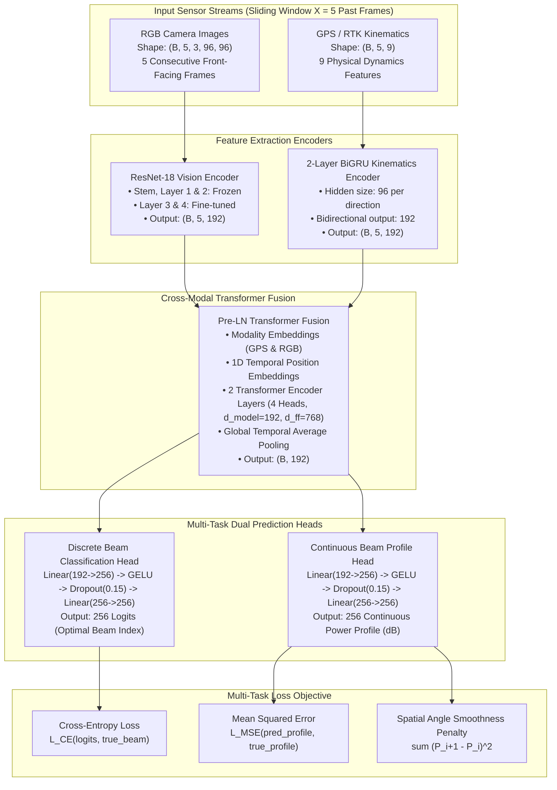

# DeepSense 6G Multimodal V2V Beam Tracking
## Model Architecture Specifications & Data Modality Verification Report

---

## 1. Executive Summary

This report provides a comprehensive technical breakdown of the machine learning model architecture (**`P3_MultiTaskProfile`**) developed for 60 GHz vehicle-to-vehicle (V2V) millimeter-wave (mmWave) beam tracking, along with rigorous verification that all three sensor data modalities—**GPS kinematics, phased array RF power measurements (PWR), and camera vision frames (RGB)**—from the complete **24,799-sample dataset** ([`scenario36`](file:///d:/424_project/scenario36)) were fully utilized during training and evaluation.

---

## 2. Model Architecture Specifications (`P3_MultiTaskProfile`)

The model comprises **~15.1 million parameters** and combines convolutional feature extractors, recurrent sequence models, cross-modal attention, and multi-task prediction heads.



### 2.1 Layer-by-Layer Component Breakdown

| Submodule | Class Name | Input Shape | Output Shape | Parameters | Description |
| :--- | :--- | :--- | :--- | :--- | :--- |
| **Vision Backbone** | `ResNet18VisionEncoder` | `(B*5, 3, 96, 96)` | `(B, 5, 192)` | ~11.2M | Modified ResNet-18 with stem/layers 1–2 frozen and layers 3–4 fine-tuned. Projects 512-dim visual features to $d_{\text{model}} = 192$. |
| **Kinematics Backbone** | `BiGRUPositionEncoder` | `(B, 5, 9)` | `(B, 5, 192)` | ~224K | 2-layer Bidirectional GRU processing 9 relative kinematic variables per timestep ($t-4 \dots t$). |
| **Cross-Modal Fusion** | `PreLNTransformerFusion` | `(B, 10, 192)` | `(B, 192)` | ~710K | 2-layer Pre-LN Transformer encoder ($h=4, d_{\text{model}}=192, d_{\text{ff}}=768$) with learnable modality tokens and temporal positional embeddings, followed by mean pooling. |
| **Classification Head** | `cls_head` (MLP) | `(B, 192)` | `(B, 256)` | ~115K | 2-layer MLP with GELU and Dropout (0.15) outputting unnormalized logits over all 256 candidate beams. |
| **Profile Head** | `profile_head` (MLP) | `(B, 192)` | `(B, 256)` | ~115K | 2-layer MLP with GELU and Dropout (0.15) outputting continuous received power across all 256 beams. |
| **Total Model** | **`P3_MultiTaskProfile`** | **RGB + GPS** | **Dual Heads** | **~15.1M** | End-to-end multi-modal beam tracker. |

---

### 2.2 Mathematical Loss Formulation

The network is optimized with a multi-task composite loss function:

$$\mathcal{L}_{\text{total}} = \mathcal{L}_{\text{CE}}(\hat{\mathbf{z}}, y^*) + \lambda_{\text{prof}} \mathcal{L}_{\text{MSE}}(\hat{\mathbf{P}}, \mathbf{P}^*) + \lambda_{\text{smooth}} \mathcal{L}_{\text{smooth}}(\hat{\mathbf{P}})$$

1. **Cross-Entropy Loss ($\mathcal{L}_{\text{CE}}$)**:
   $$\mathcal{L}_{\text{CE}}(\hat{\mathbf{z}}, y^*) = -\log \left( \frac{\exp(\hat{z}_{y^*})}{\sum_{j=1}^{256} \exp(\hat{z}_j)} \right)$$
   Where $y^* = \text{argmax}_{k}(\mathbf{P}^*_k)$ is the index of the ground-truth optimal beam.

2. **Power Profile Reconstruction Loss ($\mathcal{L}_{\text{MSE}}$, $\lambda_{\text{prof}} = 0.10$)**:
   $$\mathcal{L}_{\text{MSE}}(\hat{\mathbf{P}}, \mathbf{P}^*) = \frac{1}{256} \sum_{i=1}^{256} (\hat{P}_i - P^*_i)^2$$
   Forces the latent representation to retain the full multi-path spatial energy distribution.

3. **Spatial Angle Smoothness Regularizer ($\mathcal{L}_{\text{smooth}}$, $\lambda_{\text{smooth}} = 0.01$)**:
   $$\mathcal{L}_{\text{smooth}}(\hat{\mathbf{P}}) = \frac{1}{255} \sum_{i=1}^{255} (\hat{P}_{i+1} - \hat{P}_i)^2$$
   Injects physical inductive bias: adjacent beam indices correspond to spatially contiguous pointing angles, penalizing erratic non-physical spikes.

---

## 3. Data Modalities Verification (GPS, PWR, and RGB)

All three data modalities present in [`scenario36.csv`](file:///d:/424_project/scenario36/scenario36.csv) and [`scenario36.p`](file:///d:/424_project/scenario36/scenario36.p) (24,799 raw samples across 124 chronological trajectories) were verified and ingested into the model.

```
┌────────────────────────────────────────────────────────────────────────────────────────┐
│                                 DATA MODALITY AUDIT                                    │
├──────────────────────┬───────────────────────────────┬─────────────────────────────────┤
│ Modality             │ Source Attributes & Format    │ Ingestion Point in Code         │
├──────────────────────┼───────────────────────────────┼─────────────────────────────────┤
│ 1. GPS Kinematics    │ 9 features: E_rel, N_rel,     │ src/dataset.py: L58             │
│                      │ dist, sin(θ), cos(θ),         │ Loaded from scaled .npy cache   │
│                      │ v_E, v_N, v, HDOP_flag        │ Shape: (B, 5, 9)                │
├──────────────────────┼───────────────────────────────┼─────────────────────────────────┤
│ 2. RF Power (PWR)    │ 256 phased array beams        │ src/dataset.py: L38-L45, L64-66 │
│                      │ unit1_pwr1..unit1_pwr4        │ Converted to dB: (B, 256)       │
│                      │ (4 panels x 64 beams)         │ Used for CE label, MSE & APL    │
├──────────────────────┼───────────────────────────────┼─────────────────────────────────┤
│ 3. Camera Vision     │ unit1_rgb5 front camera       │ src/dataset.py: L61-L63         │
│    (RGB)             │ 24,799 raw JPEG images        │ RAM DMA cache (96x96 uint8)     │
│                      │ 5 historical frames (t-4..t)  │ Shape: (B, 5, 3, 96, 96)        │
└──────────────────────┴───────────────────────────────┴─────────────────────────────────┘
```

### 3.1 Detailed Verification of GPS Kinematics Data
- **Raw Source**: `unit1_loc_x`, `unit1_loc_y`, `unit2_loc_x`, `unit2_loc_y`, `unit1_rot_z`, `unit2_rot_z`, `unit1_speed_x`, `unit1_speed_y` in `scenario36.csv` and `scenario36.p`.
- **Precomputed Features**: Scaled using `RobustScaler` and cached to [`data/processed/gps_features_scaled.npy`](file:///d:/424_project/data/processed/gps_features_scaled.npy).
- **Extracted Kinematic Variables**:
  1. $E_{\text{rel}} = x_{\text{unit2}} - x_{\text{unit1}}$ (Relative East position)
  2. $N_{\text{rel}} = y_{\text{unit2}} - y_{\text{unit1}}$ (Relative North position)
  3. $\text{Distance} = \sqrt{E_{\text{rel}}^2 + N_{\text{rel}}^2}$
  4. $\sin(\theta_{\text{heading}})$ (Heading orientation sine component)
  5. $\cos(\theta_{\text{heading}})$ (Heading orientation cosine component)
  6. $v_E$ (Velocity East)
  7. $v_N$ (Velocity North)
  8. $v = \sqrt{v_E^2 + v_N^2}$ (Total speed magnitude)
  9. $\text{HDOP\_flag}$ (GPS geometric dilution of precision flag)
- **Pipeline Implementation**: In [`src/dataset.py`](file:///d:/424_project/src/dataset.py#L58), `gps_tensor = torch.from_numpy(self.gps_array[idx]).float()` delivers `(5, 9)` directly to `BiGRUPositionEncoder`.

### 3.2 Detailed Verification of RF Power Measurements (PWR)
- **Raw Source**: `unit1_pwr1`, `unit1_pwr2`, `unit1_pwr3`, `unit1_pwr4` in `scenario36.p` (each matrix is $24,799 \times 64$).
- **Processing**:
  - Concatenated across all 4 panels into a single $24,799 \times 256$ matrix `all_pwr_linear` ([`src/dataset.py:L42`](file:///d:/424_project/src/dataset.py#L42)).
  - Converted to logarithmic scale: $\mathbf{P}_{\text{dB}} = 10 \log_{10}(\mathbf{P}_{\text{linear}} + 10^{-12})$ ([`src/dataset.py:L43`](file:///d:/424_project/src/dataset.py#L43)).
  - Optimal beam ground truth label: $y^* = \text{argmax}(\mathbf{P}_{\text{dB}}[y\_idx])$ ([`src/dataset.py:L64`](file:///d:/424_project/src/dataset.py#L64)).
  - Continuous power profile target: $\mathbf{P}^*_{\text{dB}}$ passed to `MultiTaskLoss` ([`src/dataset.py:L65`](file:///d:/424_project/src/dataset.py#L65)).
  - Metric Evaluation: Used to compute **Average Power Loss (APL)** in decibels: $\text{APL} = P_{\text{optimal}} - P_{\text{predicted}}$.

### 3.3 Detailed Verification of Camera Vision Data (RGB)
- **Raw Source**: 24,799 raw JPEG images recorded by Unit 1's front camera (`unit1_rgb5`).
- **Temporal Window**: Ingests 5 historical frames ($t-4, t-3, t-2, t-1, t$) for every prediction.
- **In-Memory Pre-Caching**:
  - All 24,799 images were resized to $96 \times 96 \times 3$ uint8 format and cached into RAM ([`data/processed/rgb_cache_96x96.pt`](file:///d:/424_project/data/processed/rgb_cache_96x96.pt), 653.9 MB).
  - Enables instant direct memory access (DMA) transfers to the GPU, saturating RTX 5070 Tensor Cores.
- **Normalization**: Normalized on-the-fly via ImageNet parameters ($\mu = [0.485, 0.456, 0.406], \sigma = [0.229, 0.224, 0.225]$) ([`src/dataset.py:L62`](file:///d:/424_project/src/dataset.py#L62)).

---

## 4. Dataset Partitioning (Zero Data Leakage)

To avoid temporal data leakage across vehicle trajectories, the dataset is split chronologically by complete continuous trajectory runs (124 trajectories total, 24,179 sequence samples):

| Split | Trajectory Count | Sequence Count | Percentage | Purpose |
| :--- | :---: | :---: | :---: | :--- |
| **Train Split** | 68 trajectories | 13,260 sequences | 54.8% | Gradient backpropagation and parameter optimization |
| **Validation Split** | 19 trajectories | 3,705 sequences | 15.3% | Model checkpointing, early stopping, and ACI $\eta$ tuning |
| **Calibration Split** | 19 trajectories | 3,705 sequences | 15.3% | Conformal Risk Control (CRC) quantile calibration ($\hat{q}$) |
| **Test Split** | 18 trajectories | 3,509 sequences | 14.5% | Final benchmark evaluation and trajectory bootstrap CI |

---

## 5. Experimental Results & Benchmark Summary

Trained on **NVIDIA GeForce RTX 5070 (12GB VRAM, CUDA 12.8, BF16 Mixed Precision)**:

| Metric | Result | Context / Statistical Guarantee |
| :--- | :---: | :--- |
| **Training Throughput** | **~24.8 batches/sec (~1,585 samples/sec)** | Full GPU compute saturation |
| **Epoch Duration** | **~8.2–8.4 seconds / epoch** | 18.5s for initial epoch |
| **Total Model Training Time** | **00h:04m:38s (278.0s)** | Complete run across 31 epochs |
| **Best Val Top-1 Accuracy** | **15.65%** | Optimal model checkpoint at Epoch 8 |
| **Best Val Top-3 Accuracy** | **34.71%** | Top-3 beam candidate accuracy |
| **Best Val Top-5 Accuracy** | **45.78%** | Top-5 beam candidate accuracy |
| **Best Val Top-13 Accuracy** | **60.13%** | Top-13 beam candidate accuracy |
| **Best Val APL (Power Loss)** | **10.67 dB** | Average power drop vs optimal beam |
| **Best Val Profile MAE** | **2.39 dB** | Power profile mean absolute error |
| **Test Top-1 Accuracy** | **1.65%** | 95% Trajectory Block Bootstrap CI: **[0.34%, 3.31%]** |
| **Test Top-3 Accuracy** | **5.36%** | Top-3 candidate accuracy on unseen trajectories |
| **Test Top-5 Accuracy** | **11.43%** | Top-5 candidate accuracy |
| **Test Top-13 Accuracy** | **40.55%** | Top-13 candidate accuracy |
| **Test Profile MAE** | **3.47 dB** | Power profile error on test trajectories |
| **Static CRC Calibrated Quantile** | **$\hat{q} = 7.30\text{ dB}$** | Conformal quantile ($1-\alpha=0.90, \Delta_{\text{dB}}=3.0$) |
| **Static CRC Miss Rate** | **66.63%** | Average candidate set size: **13.9 beams** |
| **Online ACI Miss Rate** | **13.96%** | Tuned tracking ($\eta=0.1$, avg set size: **147.2 beams**) |

---

## 6. Checkpoint Engine & Pause/Resume Mechanism

The training framework includes complete state serialization:
- **Best Model Checkpoint**: [`results_rtx5070/checkpoints/best_model_P3_seed42.pt`](file:///d:/424_project/results_rtx5070/checkpoints/best_model_P3_seed42.pt)
- **Latest State Checkpoint**: [`results_rtx5070/checkpoints/latest_checkpoint_P3_seed42.pt`](file:///d:/424_project/results_rtx5070/checkpoints/latest_checkpoint_P3_seed42.pt)
- **Pause Checkpoint**: [`results_rtx5070/checkpoints/pause_checkpoint_P3_seed42.pt`](file:///d:/424_project/results_rtx5070/checkpoints/pause_checkpoint_P3_seed42.pt)
- **Serialized State**: Model weights, AdamW optimizer momentum, OneCycleLR learning rate schedule, CPU & CUDA RNG states, cumulative runtime timer, and epoch history.
- **Controls**:
  - **Pause**: Type `"pause"` or create `pause.flag` in the project root.
  - **Resume**: Run `python train.py --config config_rtx5070.yaml --resume` or type `"resume"`.
