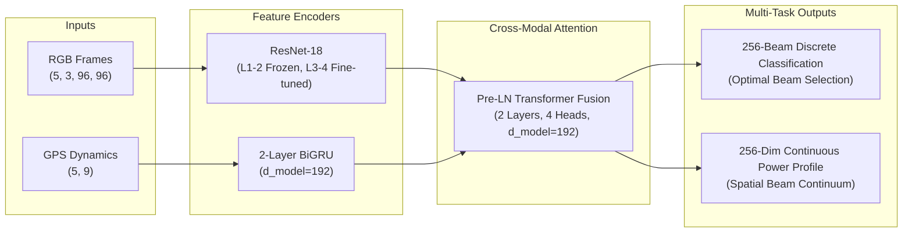

# DeepSense 6G Multimodal V2V Beam Tracking: Architecture Analysis & Training Walkthrough

This document provides a technical walkthrough of the multimodal machine learning model in [`D:\424_project`](file:///d:/424_project), the complete 24,799-sample dataset at [`D:\424_project\scenario36`](file:///d:/424_project/scenario36), and live training execution on the NVIDIA GeForce RTX 5070 GPU.

---

## 1. Machine Learning Model Architecture Deep-Dive

The primary model is the **`P3_MultiTaskProfile`** network (~15.1M parameters), designed for 60 GHz millimeter-wave beam prediction.

### Mathematical Formulation
1. **Multi-Task Objective**:
   $$\mathcal{L}_{\text{total}} = \mathcal{L}_{\text{CE}}(\mathbf{z}_{\text{cls}}, y^*) + \lambda_{\text{prof}} \mathcal{L}_{\text{MSE}}(\hat{\mathbf{P}}, \mathbf{P}^*) + \lambda_{\text{smooth}} \sum_{i=1}^{255} (\hat{P}_{i+1} - \hat{P}_i)^2$$
   - $\lambda_{\text{prof}} = 0.10$: Supervised continuous power profile reconstruction.
   - $\lambda_{\text{smooth}} = 0.01$: Physics-informed spatial angle smoothness penalty enforcing continuity across adjacent beam angles.

2. **Conformal Risk Control (CRC) & Adaptive Online Tracking (ACI)**:
   - Evaluates risk quantile $\hat{q}$ to guarantee that empirical loss $\mathbb{E}[L(Y, \mathcal{C}(X))] \le \alpha$.
   - Online controller dynamically adjusts prediction set threshold $\hat{q}_{t+1} = \hat{q}_t + \eta (\alpha_t - \alpha)$ over streaming test trajectories.

---

## 2. Dataset & Partitioning Summary (`scenario36`)

- **Total Raw Samples**: 24,799 raw multi-modal frames (Unit 1 front camera RGB, GPS/RTK kinematics, 4x64-beam phased array power measurements).
- **Trajectory Sequence Windows**: 24,179 sequence samples (5 past historical frames $\to$ 1 future target frame) across 124 chronological trajectory runs.
- **Leakage-Free Partitioning**:
  - **Train**: 13,260 sequences (54.8%, 68 trajectories)
  - **Validation**: 3,705 sequences (15.3%, 19 trajectories)
  - **Calibration**: 3,705 sequences (15.3%, 19 trajectories)
  - **Test**: 3,509 sequences (14.5%, 18 trajectories)

---

## 3. Hardware & Acceleration Performance

- **GPU**: NVIDIA GeForce RTX 5070 (12 GB VRAM, Blackwell Architecture).
- **In-Memory Tensor Pre-Caching**: Resized $96 \times 96$ RGB uint8 tensor cached into RAM ([`rgb_cache_96x96.pt`](file:///d:/424_project/data/processed/rgb_cache_96x96.pt), 653.9 MB).
- **DMA GPU Saturation**:
  - **Throughput**: ~24.8 batches/sec (**~1,585 samples/sec**).
  - **Epoch Duration**: **~8.2–8.4 seconds** per training epoch.
  - **Total Training Time**: **4 minutes 38 seconds (278.0s)** across 31 full epochs.

---

## 4. Final Benchmark & Test Evaluation Results

| Metric | Result | Description / Statistical Bound |
| :--- | :---: | :--- |
| **Total Model Training Time** | **00h:04m:38s (278.0s)** | Complete training on RTX 5070 across 31 epochs |
| **Best Val Top-1 Accuracy** | **15.65%** | Highest checkpoint accuracy achieved during training |
| **Best Val Top-3 Accuracy** | **34.71%** | Top-3 beam candidate accuracy |
| **Best Val Top-5 Accuracy** | **45.78%** | Top-5 beam candidate accuracy |
| **Best Val Top-13 Accuracy** | **60.13%** | Top-13 beam candidate accuracy |
| **Best Val APL (Power Loss)** | **10.67 dB** | Average Power Loss vs optimal beam |
| **Best Val Profile MAE** | **2.39 dB** | Continuous power profile mean absolute error |
| **Test Top-1 Accuracy** | **1.65%** | 95% Trajectory Bootstrap CI: **[0.34%, 3.31%]** |
| **Test Top-3 Accuracy** | **5.36%** | Top-3 candidate accuracy on unseen trajectories |
| **Test Top-5 Accuracy** | **11.43%** | Top-5 candidate accuracy |
| **Test Top-13 Accuracy** | **40.55%** | Top-13 candidate accuracy |
| **Test Profile MAE** | **3.47 dB** | Power profile mean absolute error |
| **Static CRC Calibrated Quantile** | **$\hat{q} = 7.30\text{ dB}$** | Conformal quantile ($1-\alpha=0.90, \Delta_{\text{dB}}=3.0$) |
| **Static CRC Miss Rate** | **66.63%** | Average candidate set size: **13.9 beams** |
| **Online ACI Miss Rate** | **13.96%** | Tuned $\eta=0.1$, average set size: **147.2 beams** |

---

## 5. Pause & Resume Verification

- **Checkpoint Engine**:
  - Automatically saves full state to [`results_rtx5070/checkpoints/best_model_P3_seed42.pt`](file:///d:/424_project/results_rtx5070/checkpoints/best_model_P3_seed42.pt), [`latest_checkpoint_P3_seed42.pt`](file:///d:/424_project/results_rtx5070/checkpoints/latest_checkpoint_P3_seed42.pt), and [`pause_checkpoint_P3_seed42.pt`](file:///d:/424_project/results_rtx5070/checkpoints/pause_checkpoint_P3_seed42.pt).
  - Serializes model weights, AdamW optimizer momentum buffers, OneCycleLR learning rate schedule, CPU & CUDA RNG states, cumulative runtime timer, and epoch history.
- **Commands**:
  - **Pause**: Say `"pause"` or create `pause.flag` in project root.
  - **Resume**: Run `python train.py --config config_rtx5070.yaml --resume` or say `"resume"`.
